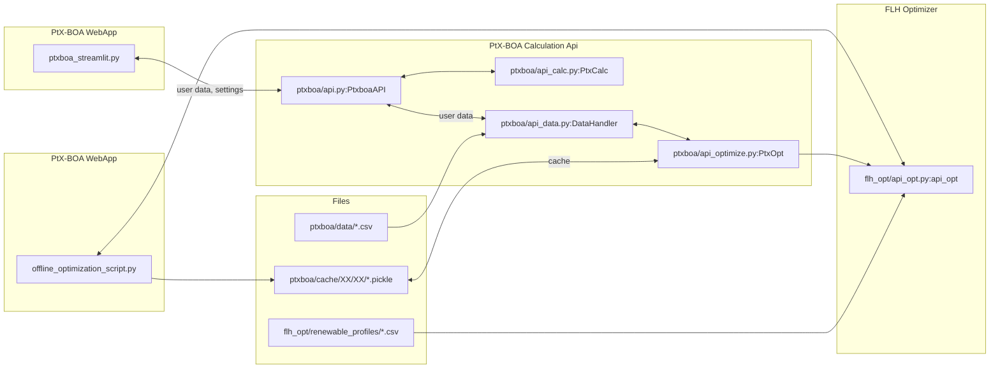

# PtX-BOA: PtX Business Opportunity Analyser

PtX-BOA is a tool that aims to promote the export of a wide range of PtX
molecules, including amongst others, green ammonia, e-methanol and synthetic
fuels. Users can calculate the delivered cost of PtX molecules from an export
country to an import country, with a detailed cost breakdown comparison
highlighting the competitive edge of one country against another.

## Development

### Setup

After cloning the repository, create a virtual python environment in a
subdirectory `.env` and activate it:

```bash
python -m venv .\.env
.env\Scripts\activate.bat
```

Install the necessary dependencies:

```bash
python -m pip install --upgrade pip
pip install -r requirements-dev.txt
```

The code is autoformatted and checked with
[pre-commit](https://pre-commit.com/). If you make changes to the code that you
want to commit back to the repository, please install pre-commit with:

```bash
pre-commit install
```

If you have pre-commit installed, every file in a commit is checked to match a
certain style and the commit is stopped if any rules are violated. Before
committing, you can also check your staged files manually by running:

```bash
pre-commit run
```

In order to run the tests locally run [pytest](https://pytest.org) in the root
directory:

```bash
pytest
```

To start the app locally, run the following command:

```
streamlit run ptxboa_streamlit.py
```

To start the app with development mode, run the following command.
Development mode has a debugging tab in blue version, and no flh optimization in blue version.

```
set "PTXBOA_MODE=dev" & streamlit run ptxboa_streamlit.py
```

### Download optimization cache for local development

```bash
cd ptxboa\cache
scp -r ptxboa2:ptx-boa_offline_optimization/optimization_cache/* .
```

## Release Procedure

- merge all relevant branches into develop
- create a relase branch
- change and commit `CHANGELOG.md` with description of changes
- update version (`bumpversion patch|minor|major`). This creates automatically a
  commit
- create pull requests to merge release into main
- merging this will automatically (via git action) create and publish the new
  docker image `wingechr/ptx-boa:<VERSION>-<BRANCH>`
- merge main back into develop

### Update docker image in production

```bash
# connect to server
ssh ptxboa

# set variables
VERSION=2.3.10
APP=app
PORT=9000
MODE=prod
CACHEDIR=/home/ptxboa/ptx-boa_offline_optimization/optimization_cache

# is preview?
IS_PREVIEW=1
if [[ "$IS_PREVIEW" == "1" ]]; then
  PORT=9001
  APP="$APP-preview"
  VERSION="$VERSION-preview"
  MODE=preview
  CACHEDIR=/home/sshfs_remote/optimization_cache
fi

# pull latest image from dockerhub
docker pull wingechr/ptx-boa:$VERSION
# stop and delete the currently running container "app"
docker stop $APP || true
docker rm $APP || true
# start the latest image as "app"
docker run -d -p $PORT:80 -v $CACHEDIR:/mnt/cache -e PTXBOA_MODE=$MODE --name $APP --restart unless-stopped wingechr/ptx-boa:$VERSION

# see logs
docker logs --follow $APP
```

### Cleanup docker images from old versions

```bash
# check which docker images are downloaded
docker image ls
# show running containers
docker ps
# delete all unused objects
docker system prune -a
```

## Testing / code coverage

```bash
pytest --cov=ptxboa --cov-report=term-missing --cov-report=html:htmlcov
```

## Internal documentation

This section contains internal documenation on data flows, structure of the code
base etc.



### Structure of input data

- csv file(s) with scalar data
- RE profiles (flh and weighting coefficients)

### Caching optimization results

- location of cached files
- hashing

### Creating renewable generation profiles

- atlite
- methodology

### The PyPSA model

The pypsa optimization model is created and solved via the
`flh_opt.api_opt.optimize()` function
<https://github.com/agoenergy/ptx-boa/blob/61a5915d3b885fb185056eac70afb50eb9b06e3a/flh_opt/api_opt.py#L148>.

Function parameters are a dictionary with all required parameters, and the path
to the folder with the renewable profiles data.

Function output is a dictionary with the results of the optimization, and the
pypsa network object that contains the solved model.

#### Example input dict

```json
{
  "SOURCE_REGION_CODE": "GYE",
  "RES": [
    {
      "CAPEX_A": 0.826,
      "OPEX_F": 0.209,
      "OPEX_O": 0.025,
      "PROCESS_CODE": "PV-FIX"
    }
  ],
  "ELY": {
    "EFF": 0.834,
    "CAPEX_A": 0.52,
    "OPEX_F": 0.131,
    "OPEX_O": 0.2,
    "CONV": {
      "H2O-L": 0.677
    }
  },
  "DERIV": {
    "EFF": 0.717,
    "CAPEX_A": 0.367,
    "OPEX_F": 0.082,
    "OPEX_O": 0.132,
    "PROCESS_CODE": "CH4SYN",
    "CONV": {
      "CO2-G": 0.2,
      "HEAT": -0.2,
      "H2O-L": -0.15
    }
  },
  "H2O": {
    "CAPEX_A": 0.07726085034488815,
    "OPEX_F": 0.0356900588308774,
    "OPEX_O": 0,
    "CONV": {
      "EL": 0.003
    }
  },
  "CO2": {
    "CAPEX_A": 0.07726085034488815,
    "OPEX_F": 0.0356900588308774,
    "OPEX_O": 0,
    "CONV": {
      "EL": 0.4515,
      "HEAT": 1.743,
      "H2O-L": -1.4
    }
  },
  "EL_STR": {
    "EFF": 0.544,
    "CAPEX_A": 0.385,
    "OPEX_F": 0.835,
    "OPEX_O": 0.501
  },
  "H2_STR": {
    "EFF": 0.478,
    "CAPEX_A": 0.342,
    "OPEX_F": 0.764,
    "OPEX_O": 0.167
  },
  "SPECCOST": {
    "H2O-L": 0.658,
    "CO2-G": 1.0
  }
}
```

#### Example output dict

```json
{
  "RES": [
    {
      "SHARE_FACTOR": 0.519,
      "FLH": 0.907,
      "PROCESS_CODE": "PV-FIX"
    }
  ],
  "ELY": {
    "FLH": 0.548
  },
  "DERIV": {
    "FLH": 0.548
  },
  "EL_STR": {
    "CAP_F": 0.112
  },
  "H2_STR": {
    "CAP_F": 0.698
  }
}
```

#### Example flowchart

This flowchart shows an example model as being created by the `optimize`
function:

![example flowchart][def]

[def]: img/optimize_flowchart.png
